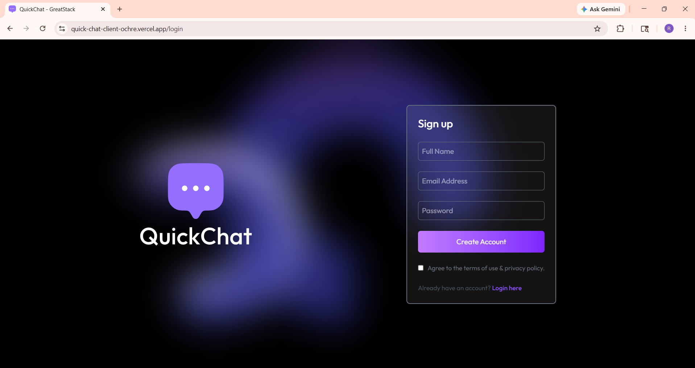
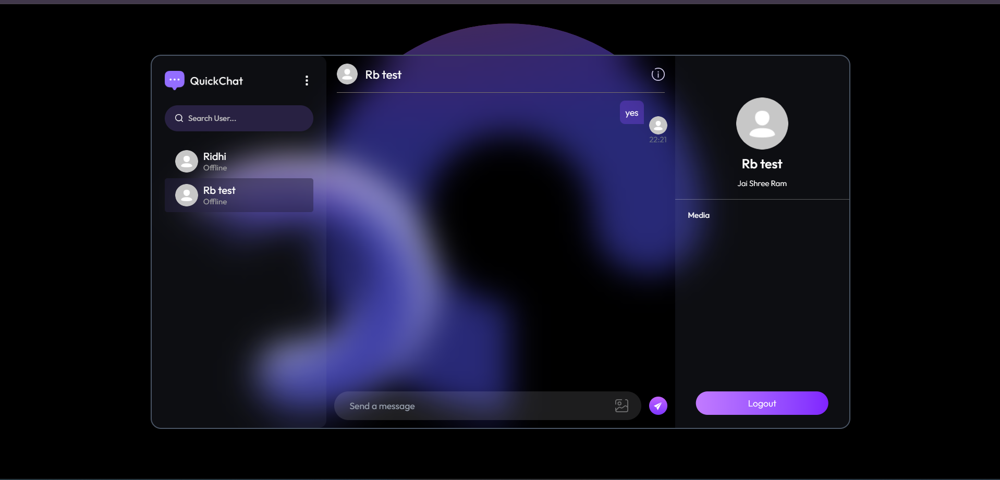

# 📨 QuickChat – Real-Time Chat Application

QuickChat is a full-stack real-time messaging web application that enables users to communicate instantly with secure authentication, live online status, image sharing, and responsive chat features.

---

## 🚀 Features

### 🔐 Authentication
- Secure user login and signup
- JWT-based authentication
- Protected chat routes
- Persistent user sessions
  
### 💬 Real-Time Messaging
- Instant messaging using Socket.IO
- Real-time online/offline status
- Live message updates
- Smooth chat experience
  
### 🖼️ Media Sharing
- Upload and share images
- Cloud-based media storage with Cloudinary
- Optimized image delivery
### 👤 User Features
- User profile management
- Active users list
- Responsive chat interface
- Mobile-friendly design
  
### 🗄️ Backend API (Express + MongoDB)
- REST APIs
- MongoDB Atlas database integration
- Secure middleware
- Real-time socket connections
  
### 🎨 Frontend (React + Vite)
- Modern responsive UI
- Fast rendering with Vite
- Axios API integration
- Clean user experience

---

## 🛠️ Tech Stack
### **Frontend**
- React
- Vite
- Axios
- Socket.IO Client
- Tailwind CSS
- Vercel Deployment
### **Backend**
- Node.js
- Express.js
- MongoDB / Mongoose
- Socket.IO
- Cloudinary
- JWT Authentication
- Vercel Deployment

---

## 🌐 Deployment Links
- Live Deployment Link: https://quick-chat-client-ochre.vercel.app/

---

## 🔧 Installation

### 1️⃣ Clone the Repository
git clone: https://github.com/Ridhi247/QuickChat-Full-Stack

cd QuickChat
### 2️⃣ Install Frontend Dependencies
cd client
npm install
### 3️⃣ Install Backend Dependencies
cd ../server
npm install
### ▶️ Run Locally
Backend
cd server
npm run server
Frontend
cd client
npm run dev

---

## 🔑 Environment Variables

- Create a .env file inside the server folder and add:

MONGODB_URI=your_mongodb_uri
JWT_SECRET=your_jwt_secret
CLOUDINARY_CLOUD_NAME=your_cloud_name
CLOUDINARY_API_KEY=your_api_key
CLOUDINARY_API_SECRET=your_api_secret

---

## 🧠 Challenges Faced
- Implementing real-time communication using Socket.IO
- Managing MongoDB connection during deployment
- Configuring environment variables on Vercel/Render
- Handling CORS between frontend and backend
- Debugging deployment and API connection issues
- Managing real-time user status updates

--- 

## 📚 Learnings
- Real-time communication with Socket.IO
- Full-stack MERN deployment workflow
- Secure JWT authentication
- Cloudinary media handling
- Backend API integration
- Debugging production deployment issues

--- 

## 🤝 Contributing

Contributions and suggestions are welcome.

## 📸 Screenshots

### 🔐 Login Page

### 📩 Chat Interface Screenshot

--- 

## ⭐ Project Highlights
- Real-time chat application
- MERN Stack architecture
- Socket.IO integration
- Secure authentication system
- Cloud-based media storage
- Production deployment experience
